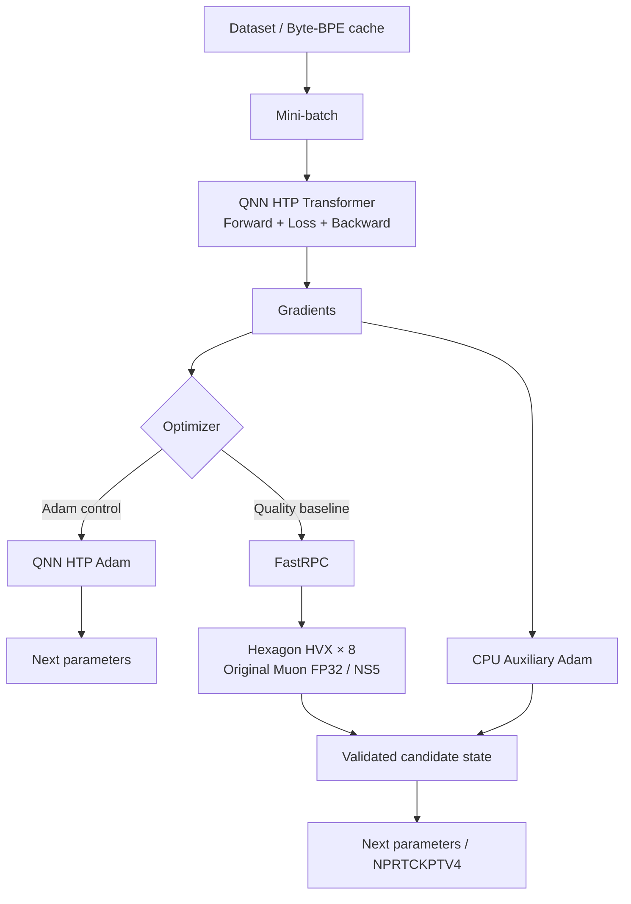

# HexaTrain

**Android / Snapdragon Hexagon HTP 上で小規模Transformerを実際に学習させる研究プロジェクト**

> **プロジェクトの目標**
>
> このプロジェクトの目標は、スマホ単体で、現実的な時間内に学習が完結する最高水準のLLMを開発することです。

HexaTrain は、モデルの Forward / Backward / オプティマイザのすべてを単一のバックエンドへ無理に押し込むのではなく、**数値精度・実行時間・データ転送コストに応じて QNN HTP / Hexagon HVX / CPU を最適に使い分けるオンデバイス学習（on-device training）基盤**です。

現在の公式品質ベースライン（Quality Baseline）では、

* Transformer の **Forward / Backward**: QNN HTP
* **Original Muon**: Hexagon HVX FP32（8ワーカー並列）
* Muon対象外パラメータの **Auxiliary Adam**: CPU

というヘテロジニアス（異種協調）構成を採用し、Snapdragon 8 Elite Gen 5 搭載端末上で8,000ステップの学習を完走しています。

なお、QNNの自動微分（AutoDiff）機能は使用していません。Forward / Loss / Backward を構成する各演算を、QNNオペレータとして計算グラフ上に明示的に構築しています。

---

## 動作検証環境・ベースライン構成 (Current status)

検証端末スペック:

| 項目 | 値 |
| --- | --- |
| デバイス | nubia Z80 Ultra / NX741J |
| SoC | Snapdragon 8 Elite Gen 5 / SM8850 |
| Hexagon | HTP V81 |
| OS | Android 16 |
| ABI | `arm64-v8a` |
| QAIRT | `2.48.40.260702` |
| QAIRT Build ID | `2.48.40.260702151143` |
| QNN Core API | `2.37.0` |
| Android NDK | `26.2.11394342` / r26c |
| compileSdk | 36.1 |
| targetSdk | 36 |
| minSdk | 26 |
| CMake | `3.22.1` |

現在の公式品質ベースライン:

| 項目 | 値 |
| --- | --- |
| 語彙数 (Vocabulary) | Byte-BPE V1024 |
| コンテキスト長 (Context) | T32 |
| 隠れ層次元 (Model dimension) | D64 |
| FFN中間次元 | 128 |
| レイヤー数 (Layers) | 19 |
| アテンションヘッド数 (Attention heads) | 2 |
| ヘッド次元 (Head dimension) | 32 |
| 総パラメータ数 | **758,528** |
| バッチサイズ | 8 |
| Forward / Backward バックエンド | **QNN HTP** |
| メインオプティマイザ | **Original Muon / HVX FP32 (8 workers)** |
| 補助オプティマイザ | **CPU Adam** |
| チェックポイント形式 | `NPRTCKPTV4` |
| 学習ステップ数 | 8,000 steps |

---

## アーキテクチャ (Architecture)

現在のベースラインは、小型の Causal Transformer（因果的言語モデル）です。

```text
Byte-BPE token
    │
    ▼
Token Embedding
    +
scaled sinusoidal position
    │
    ▼
┌─────────────────────────────┐
│ LayerNorm                   │
│   ↓                         │
│ Causal Multi-Head Attention │
│   ↓                         │
│ Residual                    │
│                             │
│ LayerNorm                   │
│   ↓                         │
│ Linear → ReLU → Linear      │
│   ↓                         │
│ Residual                    │
└─────────────────────────────┘ × 19
    │
    ▼
Output Projection
    │
    ▼
Cross Entropy
```

各Transformerレイヤーの構成:

* LayerNorm
* `Wq / Wk / Wv / Wo`
* Causal Multi-Head Attention
* 残差接続（Residual connection）
* LayerNorm
* `W1 → ReLU → W2`
* 残差接続

位置エンコーディング（Position Encoding）には、固定のSin/Cos埋め込みを入力Embeddingへ加算する方式を採用しています。RoPE、RMSNorm、Gated FFNなどは現行の公式ベースラインにはまだ含まれていません。

また、入力Embeddingと出力プロジェクション（Output Projection）の重みは共有せず、独立したパラメータとして保持しています。

---

## バックエンドの配置方針 (Backend placement)

HexaTrainでは、「QNN上で実行可能か否か」だけでバックエンドを決定しません。

**「要求される数値精度を満たしつつ、実機上で最も効率的な実行経路を選択する」** ことを基本方針としています。



CPU処理も完全に排除しているわけではなく、以下の処理は依然としてCPUが担っています:

* データセットおよびミニバッチのオーケストレーション
* QNN / FastRPC の呼び出し制御
* チェックポイントのI/O処理
* 検証およびフェイルクローズ（安全停止）の判定
* 補助オプティマイザ（Auxiliary Adam）の計算
* Androidのライフサイクル管理 / テレメトリ収集

そのため、本プロジェクトでは

> 「QNN HTPとHVXを活用したオンデバイストレーニング」

とは表現しますが、

> 「NPU単体ですべて学習した」  
> 「CPUを一切使わずに完結させた」  
> 「QNNが自動微分した」  

といった表現は用いていません。

---

# 公式品質ベースライン: HVX版 Original Muon

## パラメータの分割方針 (Parameter split)

全758,528パラメータのうち、更新を担当するオプティマイザを次のように分割しています:

| オプティマイザ | 対象 | パラメータ数 |
| --- | --- | ---: |
| **Original Muon** | `Wq/Wk/Wv/Wo/W1/W2` × 19層 = 計114個の重み行列 | **622,592** |
| **Auxiliary Adam** | Embedding / Output Projection / 正規化パラメータ等 | **135,936** |

パラメータの分類には、変数名の部分一致などの曖昧な判定ではなく、明示的なパラメータレジストリとセマンティックロール（役割定義）を使用しています。

Muonアルゴリズムの識別子（Identity）:

```text
keller_original_64560829_fp32
```

固定ハイパーパラメータ:

* momentum: `0.95`
* Nesterov: `true`
* Newton–Schulz iterations: `5`
* epsilon: `1e-7`
* 多項式係数:
  * `a = 3.4445`
  * `b = -4.7750`
  * `c = 2.0315`

これは「高速化のために簡略化した別種のMuon」ではなく、オリジナルのMuonアルゴリズムをそのままHVX FP32上で実行するバックエンドです。

---

## 学習率スケジュール (Learning-rate schedule)

公式ベースラインには、S4000スタイルのスケジュールを採用しています。

| フェーズ | Muon 学習率 | Aux Adam 学習率 |
| --- | ---: | ---: |
| 1〜4,000 steps | `0.005` | `0.0022` |
| 4,000〜8,000 steps | 線形減衰（Linear decay） | 線形減衰（Linear decay） |
| 8,000 step（最終値） | `0.0002272727…` | `0.0001` |

Muon側の目標学習率は、Adam側の減衰率に合わせて次のように算出し、同じ相対比率で線形減衰させています:

```text
0.005 × (0.0001 / 0.0022)
= 0.0002272727...
```

---

# 品質評価結果 (Quality result)

評価指標には **bits per original UTF-8 byte (bpb)** を採用しています。

Byte-BPEのトークン単位のLossではなく、元のUTF-8バイト量に対する負の対数尤度（NLL）として評価することで、トークナイザーを変更した場合でも公平に比較できるメトリックにしています。

8,000ステップ、異なる2つのシード（Seed）による検証結果:

| オプティマイザ | seed 1 | seed 2 | 平均 (mean) |
| --- | ---: | ---: | ---: |
| Adam S4000 Balanced | 2.413116 | 2.405908 | **2.409512** |
| HVX Muon Balanced | **2.337821** | **2.350119** | **2.343970** |
| Muon − Adam (差分) | −0.075295 | −0.055789 | **−0.065542 bpb** |

両シードともに、以下の改善が安定して再現されました:

* Balanced（総合評価）の改善
* Validation（検証セット）の改善
* Development（開発セット）の改善

また、8,000ステップ完走時点でのエラー発生状況は以下の通りです:

```text
RPC failure = 0
fallback    = 0
non-finite  = 0 （NaN/Infの発生なし）
```

この結果に基づき、現在は以下の方針を定めています:

> **「HVX Muon + Auxiliary Adam」を品質最優先実験のメインベースラインとする**  
> **「Adam S4000」は独立した安定稼働用コントロール（対照群）として保持する**

詳細ドキュメント:

* [HVX FP32 Muon / formal baseline](docs/nicopedia-hvx-muon.md)
* [Adam S4000 seed-2 validation](docs/nicopedia-hpo-v1024-d64-ffn128-schedule-seed2-validation.md)

---

## 計算の正当性と再現性の定義 (Correctness semantics)

HVX版Muonの挙動に関しては、以下の3段階の検証基準を厳密に区別しています。

| 検証ゲート | 結果 | 判定内容 |
| --- | --- | --- |
| 単一ステップ更新 vs CPUオラクル (Single-update vs CPU oracle) | **PASS** | 単一ステップでの計算誤差が許容値以内 |
| 連続実行 vs 中断・再開 (HVX uninterrupted vs HVX resume) | **PASS / 完全一致** | チェックポイント再開後もビット単位で完全一致 |
| 長期間のパラメータ軌道 vs CPU倍精度オラクル (Long-horizon trajectory vs CPU double oracle) | **NOT SATISFIED** | 複数ステップ経過後のパラメータ軌道は一致しない |

単一ステップの更新では、CPU実装との比較において以下の通り極小の誤差に収まることを確認しています:

* 最大絶対誤差 (worst maxAbs) ≈ `1.49e-8`
* 相対L2誤差 (worst relative L2) ≈ `4.4e-8`
* コサイン類似度 (cosine) ≈ `1`

一方で、浮動小数点演算の丸め誤差の蓄積により、CPUの倍精度（double）実装とHVXの単精度（FP32）実装とでは、複数ステップ経過後に同一のパラメータ軌道（Trajectory）を維持し続けることはできません。

したがって、

> 「HVX版Muonは、長時間の学習においてもCPU実装とほぼビット単位で一致する」

という主張は行いません。

HVX FP32版Muonは、単一ステップの厳密な正当性、学習品質、長時間の安定性、およびチェックポイント再開時の再現性を満たした **Original Muonの独立した数値実装** として位置づけています。

---

# なぜHVXを採用したのか？ (Why HVX?)

当初は Original Muon についても QNN HTP の計算グラフのみで実装することを試みました。

しかし、Newton–Schulz反復処理において行列積（MatMul）の誤差が急激に累積する問題に直面しました。

CPUオラクルに対する相対L2誤差の推移:

| 処理フェーズ | 相対L2誤差 (vs CPU oracle) |
| --- | ---: |
| 正規化入力 (Normalized input) | ≈ `8.3e-4` |
| Newton–Schulz反復 1回目 | ≈ `2.15e-3` |
| Newton–Schulz反復 5回目 | ≈ `5.22e-2` |

QNN上でテンソルをFLOAT32型として明示的に宣言しても、内部演算の挙動により、この反復計算に不可欠なCPU FP32相当の数値精度は得られませんでした。

そのため、

```text
QNN HTP : Forward / Backward
    +
Hexagon HVX FP32 : Original Muon
```

というハイブリッド構成へと移行しました。

HVX版の実装では、以下の最適化を行っています:

* カスタムFastRPCによる低遅延通信
* 128バイトHVXベクトル拡張の活用
* 8ワーカー並列実行
* QHL / HVX FP32プリミティブによる高精度演算
* 114個の重み行列を1回のRPCで一括処理
* ホスト / RPCバッファの永続確保（アロケーションオーバーヘッドの排除）
* RPC出力のダイレクトアンパック
* 不正値を検知した際のフェイルクローズな状態反映機構

詳細ドキュメント:

* [HTP-native Muon investigation](docs/nicopedia-htp-muon.md)
* [HVX FP32 Muon](docs/nicopedia-hvx-muon.md)

---

# 実行性能・スループット (Runtime)

公式HVX Muon実行時の実測値:

| 計測項目 | 実測値 |
| --- | ---: |
| seed 1 平均ステップ時間 | `1307.45 ms/update` |
| seed 2 平均ステップ時間 | `1319.12 ms/update` |
| 2シード平均 | **`1313.29 ms/update`** |
| seed 2 新規8,000ステップ完走時間 | **10,552.95秒（約2.93時間）** |

過去のAdam S4000の後半フェーズ（4,000〜8,000ステップ）のログでは、

```text
4000 → 8000 steps:
4806.93 ms/update
```

が記録されています。

記録されたRun同士の単純比較では約 **3.66倍** のEnd-to-Endスループット差がありますが、この比較には以下の交絡要因が含まれます:

* Adam側のデータが新規8,000ステップ通しではなく、4,000ステップからの再開データである点
* 実行ランナーや周辺実装の世代（バージョン）が異なる点

したがって、これはあくまで

> **「過去の実験ログ同士におけるEnd-to-End実測スループットの比較」**

であり、

> 「Muonオプティマイザの演算プリミティブ単体がAdamより3.66倍高速である」

ことを意味するものではありません。

---

# チェックポイントと再開機能 (Checkpoint / resume)

Adam系とMuon系のチェックポイントは、データ構造と意味論を明確に分離しています。

Muon公式ベースラインの形式:

```text
NPRTCKPTV4
optimizer = muon_aux_adam
```

V4フォーマットには、以下の情報を保持します:

* モデルおよびトークナイザーの識別情報（Identity）
* グローバルなオプティマイザステップ数
* データセットのカーソル位置および読み込み順序の識別情報
* Muonのハイパーパラメータ
* パラメータごとの役割定義（Role）
* Muonのモメンタム
* Auxiliary Adamの1次/2次モーメント（M / V）

パラメータの役割（Role）ごとに保存対象を厳密に分けています:

```text
MUON     -> モメンタムのみ
AUX_ADAM -> AdamのMおよびV
```

互換性のないオプティマイザやチェックポイントを暗黙的に読み替えることはせず、整合性が取れない場合はフェイルクローズ（安全側に倒して処理を中断）します。

なおHVXバックエンドにおいて、

```text
「最初から100ステップ連続実行した場合」
```

と

```text
「50ステップ実行 → 保存 → プロセス/セッションを完全終了 → 再開して100ステップまで実行した場合」
```

の最終チェックポイントのSHA-256ハッシュ値が完全に一致することを確認済みです。

---

# テキスト表現とトークナイザー (Text representation)

現在の品質ベースラインでは、決定的な挙動を持つ **Byte-BPE (語彙数1024)** を採用しています。

* 基本バイト語彙数: 256
* マージ（Merge）数: 768
* 総語彙数: 1,024
* トークナイザーモデル形式: `NPRTBPEM1`
* キャッシュ形式: `NPRTBPEV1`

トークナイザーのSHA-256ハッシュ値は、データセットキャッシュ、チェックポイント、評価、生成時の識別子と厳密に紐付けられています。

公式トークナイザーの識別情報:

```text
sha256:9a70e5929e6556a147b0fbc6ada7afefa5e144cdfe2d83bd60e6b31a13252798
```

※従来のRaw-Byte（語彙数256）のパスも互換性のために残されています。

---

# 評価プロトコル (Evaluation protocol)

モデルの性能比較には、主に以下の指標を用います:

* Validation（検証セット）
* Development（開発セット）
* Balanced = `(Val + Dev) / 2`
* 元のUTF-8バイト換算のビット数（bits per original UTF-8 byte: bpb）

Adam S4000スケジュールについては、ハイパーパラメータ探索（HPO）の完了後に、あらかじめ固定しておいた512ウィンドウの1回読み切りテストサンプル（Read-once final sample）を用いて汎化性能の最終確認も行っています。

なお、Muonを公式ベースラインに昇格（Promote）させる判断にあたっては、この最終テストサンプルを再利用（過学習）していません。

今後もテストサンプルの結果をモデル構造や学習率、オプティマイザのチューニングにフィードバックさせることはせず、新しい研究候補はVal/Devを用いたワークフローで厳格に比較・評価します。

詳細ドキュメント:

* [V1024/D64/FFN128 final evaluation](docs/nicopedia-v1024-d64-ffn128-final-evaluation.md)

---

# Androidアプリ実装 (Android app)

HexaTrainには、研究開発用のヘッドレスランナーだけでなく、Androidアプリ上で動作する学習・テキスト生成UIも実装されています。

## バックグラウンド長時間の学習実行 (Long-running training)

スタンドアロン学習の実行管理には **WorkManager** を使用しています。

```text
Activity
  ↓
TrainingWorkCoordinator
  ↓
unique WorkManager work
  ↓
StandaloneTrainingWorker : CoroutineWorker
  ↓
SystemForegroundService / specialUse
  ↓
native QNN training
  ↓
checkpoint / progress
```

検証済みの機能・耐久性:

* フォアグラウンド通知の表示
* 学習の開始 / 一時停止 / 再開
* 重複実行を防ぐユニークワーク（Single-flight）制御
* 構造化された進捗レポート
* アプリ専用領域への永続的なメタデータ保存
* チェックポイントベースのリカバリ機能
* 画面消灯時やDozeモード（省電力待機）中における学習の継続実行
* 約4時間の連続負荷試験（Soak test）の完走
* Android 16環境下での8,000ステップ完走
* プロセスを意図的に強制終了させた後のチェックポイント復帰
* 協調的一時停止（Cooperative stop）およびリソースのクリーンアップ

WorkManagerおよびAndroidライフサイクルに関する詳細:

* [Android long-running WorkManager training](docs/android-long-running-workmanager-training.md)

### 重要: 研究用ベースラインとGUI学習プリセットの違い

現在検証されている公式の品質ベースライン

```text
V1024 / T32 / D64 / FFN128 / L19 / H2 / HVX Muon
```

は、**研究用のヘッドレス実行パスにおいて検証された構成**です。

現行のAndroid GUIアプリのプリセットカタログはこれとは別に制限されており、

* GUI学習で選択可能なFFN次元数は現在 `32 / 48 / 64` に制限されています
* V1024のスタンドアロン学習は、公式BPEトークナイザーモデルのインポート機能がGUI側に未統合のため、安全のため実行を拒否（Fail closed）します

つまり、現行のAndroidアプリの画面上から「公式HVX Muonベースライン」をそのまま選択して学習できる状態にはまだなっていません。

（※テキスト生成側は学習カタログとは独立したポリシーを持っており、FFN128を含む検証済みチェックポイントの読み込みに対応しています。）

---

# テキスト生成 (Generation)

学習済みチェックポイントを用い、QNN HTP上で自己回帰（Autoregressive）生成を行うパスも実装されています。

生成処理専用に、

```text
TinyTransformerTrainingVariant::FORWARD_ONLY
```

というバリアントを用意しており、

* 正解ラベル（Target）
* 損失計算（Loss）
* 勾配計算（Gradient）
* 逆伝播（Backward）
* オプティマイザ（Optimizer）

を計算グラフから完全に除外した、Forward処理専用の最適化グラフを使用します。

19層 / 2ヘッド構成（L19/H2）におけるノード数・テンソル数の比較:

| 計算グラフ | ノード数 | テンソル数 |
| --- | ---: | ---: |
| 全学習グラフ (FULL training graph) | 2,384 | 2,912 |
| Forward専用グラフ (FORWARD_ONLY) | **953** | **1,877** |

さらに、プロセス内で生成エンジンを初期化・保持（Prepared Generation Engine）することで、

* QNNのバックエンド / デバイス / コンテキスト
* 最適化・確定済みのFORWARD_ONLYグラフ
* チェックポイントから展開したパラメータ状態

を同一チェックポイント内で再利用し、オーバーヘッドを大幅に削減しています。

D64 / FFN64のチェックポイントを用いた実機測定において、同一プロセス内でのウォーム生成呼び出し（Warm generation call）の所要時間は **約1.22秒** でした。

（※この時間には意図的に行っているチェックポイントの整合性・健全性チェックが含まれており、純粋なトークンデコード時間のみの値ではありません。）

詳細ドキュメント:

* [Android Generation QNN Warmup Optimization](docs/android-generation-qnn-warmup-optimization.md)
* [Generation checkpoint import](docs/android-generation-checkpoint-import.md)

---

# ビルド手順 (Build)

## 必要環境 (Requirements)

検証済みのツールチェーン:

* OS: Windows
* シェル: PowerShell 7以上
* JDK: 17
* Android SDK: compileSdk 36.1
* Android NDK: `26.2.11394342` / r26c
* CMake: `3.22.1`
* Qualcomm QAIRT: `2.48.40.260702151143`
* Hexagon SDK 6.6 + Hexagon Tools 19.0.07（HVX Muon使用時のみ必須）
* MNN 3.5.0 ソースコード（レガシーなCPU/OpenCL/Vulkanモード用）

MNNの取得:

```powershell
.\scripts\fetch_mnn.ps1
```

QAIRTのバージョンおよびインストールパスは、

```text
scripts/qairt_version.ps1
```

を信頼できる唯一の情報源（Single Source of Truth）として厳格に管理しています。異なるQAIRTバージョンへの暗黙的なフォールバックは行いません。

---

## QNN有効化ビルド (QNN-enabled build)

```powershell
$env:ANDROID_HOME = Join-Path $env:LOCALAPPDATA 'Android\Sdk'
$env:ANDROID_SDK_ROOT = $env:ANDROID_HOME

$QairtSdkRoot = $env:QAIRT_SDK_ROOT

.\gradlew.bat :app:assembleDebug `
  '-Pphonelm.enableQnn=true' `
  "-Pqairt.sdkRoot=$QairtSdkRoot" `
  '-Pqairt.expectedBuildId=2.48.40.260702151143' `
  --no-daemon
```

---

## QNN + HVX Muon ビルド

HVX版Muonをビルドする場合は、追加でHexagon SDKが必要です。

```powershell
$QairtSdkRoot = $env:QAIRT_SDK_ROOT
$HexagonSdkRoot = $env:HEXAGON_SDK_ROOT

.\gradlew.bat :app:assembleDebug :app:assembleDebugAndroidTest `
  '-Pphonelm.enableQnn=true' `
  '-Pphonelm.enableHvxMuon=true' `
  "-Pqairt.sdkRoot=$QairtSdkRoot" `
  '-Pqairt.expectedBuildId=2.48.40.260702151143' `
  "-Phexagon.sdkRoot=$HexagonSdkRoot" `
  --no-daemon
```

ビルド時にはQAICおよびHexagon Clangコンパイラを用いて、

```text
libhexatrain_hvx_probe_skel.so
```

をHexagon V81 / 128バイトHVX向けに動的生成します。

HVX DSP用ライブラリ、QNN関連ライブラリ、Stub、Skel等のバイナリはGitリポジトリにはコミットしません。

---

# 動作確認・テスト (Verification)

軽量なローカルテスト:

```powershell
pwsh -NoProfile -File .\scripts\verify_local.ps1 -Fast
```

ホスト側テスト:

```powershell
.\scripts\run_host_tests.ps1
```

QAIRTが関連する変更の検証時には、指定のSDKパスとBuild IDを明示した上でQNN有効化ビルドを実行し、APK監査スクリプトを実施します。

研究用学習ランナー:

```text
scripts/run_nicopedia_htp_training.ps1
```

このスクリプトは以下の機能を制御します:

* Adam / Muon オプティマイザの選択
* CPU / HVX Muon バックエンドの切り替え
* チェックポイントの保存と再開
* 学習率スケジュールの適用
* エラー検知時のフェイルクローズ処理
* 実機上でのヘッドレス実行

※長時間の学習が意図せず開始されるのを防ぐため、引数と実験プロトコルを十分に確認した上で実行してください。

---

# リポジトリ構成 (Repository layout)

```text
app/
├─ src/main/cpp/
│  ├─ qnn/
│  │  ├─ qnn_runtime_qairt.cpp
│  │  ├─ qnn_runtime_transformer_training_generalized.inc
│  │  ├─ qnn_transformer_training.cpp
│  │  └─ qnn_prepared_generation.cpp
│  │
│  ├─ nicopedia_muon_optimizer.*
│  ├─ nicopedia_htp_muon.*
│  ├─ nicopedia_hvx_muon.*
│  ├─ nicopedia_muon_checkpoint.*
│  ├─ nicopedia_byte_bpe.h
│  └─ tiny_language_model_cpu.*
│
├─ src/main/java/com/yuubinnkyoku/phonelm/
│  ├─ TrainingSession.kt
│  ├─ StandaloneTrainingWork.kt
│  ├─ ModelConfiguration.kt
│  ├─ GenerationSession.kt
│  └─ ui/
│
host_tests/
├─ hvx_rpc/
└─ *_test.cpp
│
scripts/
├─ run_nicopedia_htp_training.ps1
├─ verify_local.ps1
├─ audit_qnn_apk.ps1
└─ ...
│
docs/
├─ nicopedia-hvx-muon.md
├─ nicopedia-htp-muon.md
├─ nicopedia-v1024-d64-ffn128-final-evaluation.md
├─ android-long-running-workmanager-training.md
├─ android-generation-qnn-warmup-optimization.md
└─ ...
```

---

# 主なドキュメント (Important documents)

本プロジェクトの研究成果や技術詳細を把握するには、まず以下のドキュメントを参照してください。

### 現在の公式品質ベースライン

* [HVX FP32 Muon / formal baseline](docs/nicopedia-hvx-muon.md)
* [V1024 D64/FFN128 capacity experiment](docs/nicopedia-byte-bpe-v1024-d64-ffn128.md)
* [Adam schedule seed-2 validation](docs/nicopedia-hpo-v1024-d64-ffn128-schedule-seed2-validation.md)
* [Frozen final evaluation](docs/nicopedia-v1024-d64-ffn128-final-evaluation.md)

### 数値計算およびバックエンドの技術検証

* [HTP-native Muon investigation](docs/nicopedia-htp-muon.md)
* [QNN Transformer op feasibility](docs/qnn-transformer-op-feasibility.md)
* [QNN HTP generic Transformer resource envelope](docs/qnn-htp-generic-depth-head-resource-envelope.md)

### Android実装関連

* [Long-running WorkManager training](docs/android-long-running-workmanager-training.md)
* [Standalone HTP training](docs/android-standalone-htp-training.md)
* [Generation QNN warmup optimization](docs/android-generation-qnn-warmup-optimization.md)
* [Generation checkpoint import](docs/android-generation-checkpoint-import.md)

---

# 今後の研究方針 (Current research direction)

現在の主眼は、Muonバックエンドの実行時間をさらに数ミリ秒削ることではなく、**確立した学習ベースラインを活用してモデル自体の品質（精度）を向上させること**です。

直近の候補:

* Gated Attention の導入
* RMSNorm / QK-Norm の検証
* Gated FFN の導入
* 埋め込み層の重み共有（Tied Embedding）
* パラメータ数を統一したモデル構造（D / FFN / L / H）の探索
* Attentionレイヤーの配置最適化
* 評価エンジンのバッチ化および永続化（実行高速化）
* データセット、トークナイザー、テキスト表現の最適化探索

中長期的な検討テーマ:

* Gated DeltaNet やリカレントハイブリッド構造の導入
* マルチトークン予測（Multi-Token Prediction: MTP）
* 低ビット学習（Low-bit training）
* アクティベーションおよびオプティマイザ状態のメモリ圧縮
* メモリ効率化および再計算プランニング（Recomputation）
* QNNとHVX間の最適なバックエンド配置探索

これらについて、実機上での品質、所要時間（Wall time）、メモリ消費量（RAM）、データ転送コストを総合的に比較・評価していきます。

---

# 開発の経緯・マイルストーン (Historical milestones)

HexaTrainは、最初からTransformerの学習を実装できたわけではありません。

初期には、

* 線形回帰（Linear Regression）
* dW / dX の極小計算グラフ（Micro graphs）
* 2層ReLU MLP
* Fused Backward（勾配計算の統合）
* MSE損失とSGDを含む1ステップ学習グラフ全体の構築

といったステップを順にQNN HTP上へ載せ、QNN上で学習演算の計算グラフを明示的に構築できることを検証してきました。

その後、以下のように段階的な発展を遂げています:

```text
MLP（多層パーセプトロン）
 → 小型Transformer
 → マルチレイヤー / マルチヘッドTransformer
 → 実テキスト（ニコニコ大百科データ）の学習
 → Byte-BPEの導入
 → チェックポイント保存・再開の完全一致検証
 → Android WorkManagerによる長時間の安定学習
 → 実機上でのForward専用テキスト生成
 → Adam学習率スケジュールの最適化（HPO）
 → Original Muonオプティマイザの実装
 → HVX FP32バックエンドの確立
 → 8,000ステップ × 2シードでの品質ベースライン達成
```

※初期のMLP実験コードはリグレッションテストやバックエンド診断用として残されていますが、現在の研究のメイン対象ではありません。

---

# 制約事項・注意点 (Limitations)

* 実機検証は主に `arm64-v8a` アーキテクチャおよび Hexagon HTP V81 を対象としています。
* Qualcomm QAIRT および Hexagon SDK のバイナリはリポジトリに同梱していません。
* QNN HTP内部の演算精度は、テンソル宣言時のデータ型（dtype）のみから一意に決定されるわけではありません。
* HTPネイティブのOriginal Muonは、Newton–Schulz反復計算時の精度不足のため本番採用を見送っています。
* 現在の公式HVX Muonベースラインは研究用ヘッドレス実行で検証された構成であり、Android GUIアプリの学習プリセットには未統合です。
* Android GUIにおける語彙数1024（V1024）のスタンドアロン学習は、公式BPEモデルのインポート機能が未実装のためフェイルクローズします。
* HVX版MuonとCPU倍精度版Muonは、長期間のステップにおいて同一のパラメータ軌道を辿ることを保証していません。
* WorkManagerによる4時間超の連続動作テストは通過していますが、あらゆるOEMの独自カスタマイズ、発熱によるサーマルスロットリング、Deep Sleep、LMK（Low Memory Killer）の条件下での動作を保証するものではありません。
* 実機での処理性能は、端末の発熱状態、バッテリー残量、実行環境の世代等によって変動します。
* 過去の異なる実験環境のログ同士の速度比をもって、「オプティマイザの演算プリミティブ単体の純粋な速度差」と解釈することはできません。

---

# QAIRTおよびサードパーティ製バイナリの扱い (QAIRT / third-party binaries)

QAIRTライブラリ、HTP Stub/Skel、Hexagon DSPバイナリ等をGitリポジトリに追加・コミットすることはありません。

QNNを有効化したローカルビルドでは、ローカル環境に配置された正規のSDKを検証した上でビルドディレクトリへステージングし、必要なランタイムのみをAPK内に組み込みます。

ローカル環境でAPKがビルドできたとしても、Qualcomm社が配布するバイナリを第三者へ再配布する権利が付与されるわけではありません。公開・配布時には各社のライセンス条項を必ず確認してください。

また、MNN等のサードパーティ製コンポーネントについても、それぞれのライセンスが適用されます。

---

# ライセンス (License)

HexaTrain / PhoneLM のオリジナルソースコードおよび付属ドキュメントは、特記のない限り [Apache License 2.0](LICENSE) の下で公開されています。

Qualcomm QAIRT/QNN、Hexagon SDK、MNN、その他のサードパーティ製成果物には本ライセンスは適用されません。  
詳細は [THIRD_PARTY_NOTICES.md](THIRD_PARTY_NOTICES.md) を参照してください。