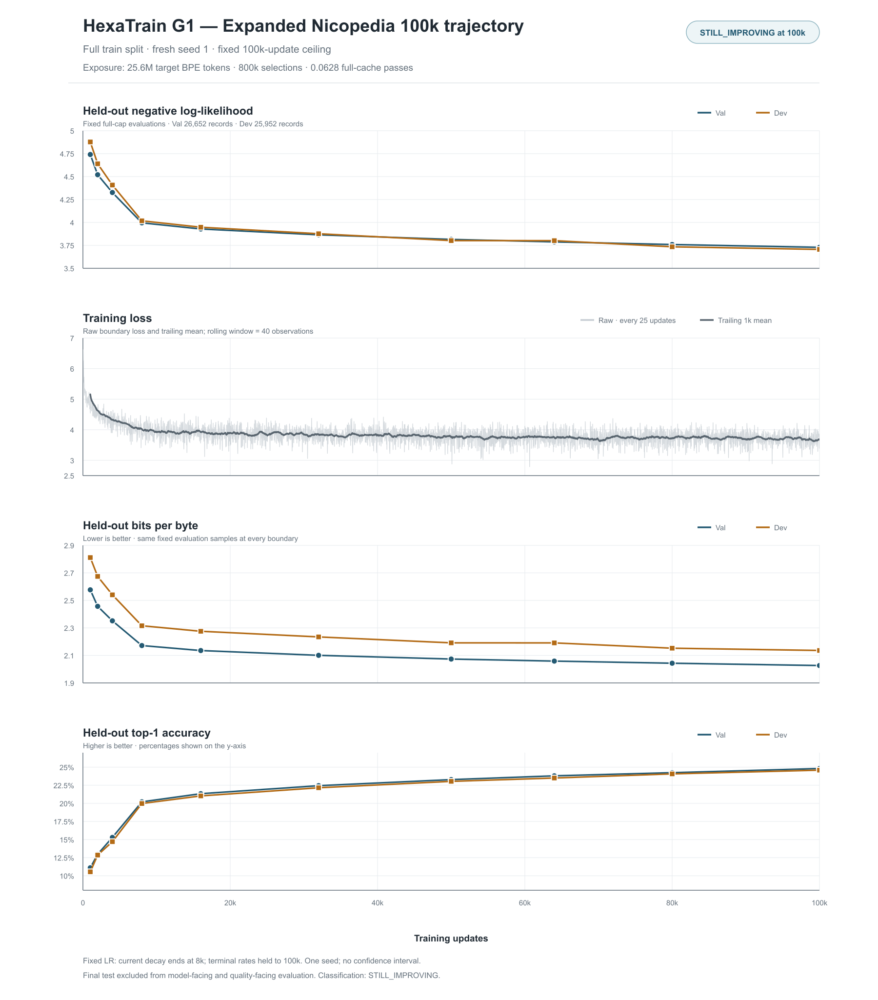

# HexaTrain G1 Expanded Nicopedia 100k Convergence Experiment

**Status: COMPLETED_100000** (100,000/100,000 updates; all 21 segments and 10 fixed full-cap evaluations completed)
**Dedicated branch:** `experiment/g1-expanded-data-100k`
**Exact base:** `c2cf560328c7257fc61e21d7df76388672245e5d` (`origin/main` at start)
**Research baseline:** G1, seed 1
**Hard ceiling:** 100,000 updates
**Final-test quality access:** prohibited; `final_test_opened=false` (identity-only dedupe scan is recorded separately)

This experiment measures the G1 baseline on the full eligible Nicopedia train split under a fixed 100k-step policy. It does not change production defaults, architecture, optimizer mathematics, tokenizer, batch size, or weight decay. The run must reach 100,000 updates unless a systems or numerical health failure prevents continuation. There is no quality-based early stop.

[Vector SVG version](figures/g1-expanded-data-100k-convergence.svg)

## Dataset and provenance

- Source aggregate SHA-256: `b3185ea689ffa64c71f5ea8fe25f3779dbf1f0cd0d103b6e2fe05792e635bf86`.
- Selection: full Nicopedia train split after the existing cleaning, corpus-wide exact-text deduplication, and article-level split assignment. No external dataset was added and no quality-informed subset was selected.
- Train: 259,417 articles; 1,084,316,091 cleaned UTF-8 bytes; 12,741,465 T32 records; 407,726,880 target BPE tokens; 1,071,752,656 represented original UTF-8 bytes.
- Validation: 14,312 articles / 58,945,546 cleaned UTF-8 bytes / 26,652 T32 records.
- Development: 11,554 articles / 48,317,439 cleaned UTF-8 bytes / 25,952 T32 records.
- Final test: 2,931 articles / 12,765,373 cleaned UTF-8 bytes. It is excluded from all training and quality evaluation.
- The corpus-wide exact-text dedupe scan read final-test cleaned-text identity only, before split assignment, to preserve the existing dedupe rule and verify split integrity. No final-test text was tokenized into a training/evaluation cache, sampled, exposed to the model, or used for quality/model/schedule/checkpoint selection. This dedupe-only scan is separately recorded while `final_test_opened=false` retains its model-facing and quality-facing meaning.
- Machine-checked train/validation/development/final-test article-ID and article-hash intersections: zero.
- Tokenizer: unchanged V1024 byte-BPE, vocabulary 1,024; SHA-256 `9a70e5929e6556a147b0fbc6ada7afefa5e144cdfe2d83bd60e6b31a13252798`.
- Full train cache SHA-256: `bbbf966f07a65b64cf5e2a85f942cecf95c8f349c9d6b1bfb5d28191a0ce3fcf` (942,868,468 bytes).
- Training order: `SplitMix64(global_selection_index + state) modulo record_count`, seed `20260806`, with replacement. Fixed order hash: `fnv1a64:be3269f541236dc2`.
- Expanded-cache self-test passed: `NPRTBPEV1` header/schema, count/size, tokenizer identity, token-ID bounds, first/last record reads, cache-index wrap, deterministic cache hash and order hash, and data-position checkpoint round-trip. Machine-checked article-ID/hash split intersections were zero.
- At 100,000 updates the run consumed 25,600,000 target tokens / 800,000 T32 selections, 67,296,722 target UTF-8 bytes, 775,440 unique chunks, and 178,055 unique articles: 0.06278712848 full-cache passes. These are measured cumulative run counters, not estimates from cleaned-byte totals.

## Model, optimizer, and schedule

- G1 definition: `headwise_g1_sigmoid`, V1024 / T32 / D64 / FFN128 / L19 / H2; 760,960 parameters; batch 8; canonical seed 1.
- Muon: HVX_W8; peak LR 0.0075; momentum 0.95; Nesterov enabled; 5 Newton–Schulz steps; terminal LR 0.0003409090909090909.
- Auxiliary Adam: peak LR 0.0033; beta1 0.9; beta2 0.999; epsilon `1e-8`; terminal LR 0.00015.
- Weight decay is 0; gradient clipping is disabled.
- Fixed LR expression: auxiliary Adam linear decay from 0.0033 at step 4,000 to 0.00015 at step 8,000; Muon proportional linear decay from 0.0075 to 0.0003409090909090909 over the same interval; both rates clamp to and hold their terminal values after step 8,000 through the 100,000 hard ceiling.
- The schedule total-step metadata is 100,000. Peak rates and decay boundaries are not stretched to the long horizon and will not change in response to observed loss or held-out quality.
- Training starts from fresh seed-1 initialization. No 8k pilot checkpoint is used.

## Run and evaluation protocol

- Training segments: 0→1,000; 1,000→5,000; then 5,000-update segments through 100,000. A segment-boundary stop/resume control was added to the experiment runner; it does not change training math, record order, or optimizer/checkpoint state.
- Resume checkpoints are written at each 1,000-update boundary. The checkpoint contains optimizer state and data-position/exposure state. Resume-equivalence gate passed before the primary run: uninterrupted 0→2,000 and checkpointed 0→1,000→2,000 produced byte-identical step-2,000 checkpoints (`807e1a3ff5128a945b79838dc66b52766e64c26989ecac0a150d48ffbc38646b`), matching parameters and optimizer state, and matching resumed losses/data exposure.
- Fixed full-cap Val/Dev checkpoints: 1k, 2k, 4k, 8k, 16k, 32k, 50k, 64k, 80k, 100k. Every evaluation uses all 26,652 Val and 25,952 Dev records with the same tokenizer and cache. Host CPU full-cap evaluation was used only at 1k; later full-cap boundaries skip host evaluation under the fixed protocol.
- A lightweight fixed first-record-per-split check is emitted at each 1k training checkpoint. It is a health signal, not a quality-selection endpoint.
- Primary quality metrics: Val/Dev NLL and bits per UTF-8 byte (BPB), top-1, plus train loss. Final test is never run.
- Gate telemetry contains 3,800 layer/head summaries (38 per 1k boundary across 100 boundaries); optimizer/LR/gradient/parameter health telemetry contains 100 windows. Full-run aggregation is in the final analysis below.
- At every segment boundary, the orchestration checks available storage, checkpoint/report hashes, QNN success and tensor finiteness separately, HVX backend/failure/fallback counts, thermal/battery health, and exposure accounting.
- An unresolved checkpoint-transfer incident sets the private run plan to `RECOVERY_REQUIRED`. The runner now refuses to launch another segment until the affected segment’s terminal status and checkpoint identities have been recovered and the plan is explicitly reconciled.
- QNN/HTP runtime build is pinned to QAIRT `2.48.40.260702151143`. No automatic fallback or mixed QAIRT version is allowed.
- Status of issue 6031 remains `UNRESOLVED / DORMANT / WATCH`.

## Progress

The values below are cumulative exposure at the named training checkpoint. The original UTF-8 byte count represents selected record targets actually consumed, not the entire source article bytes.

| Step | Target tokens | Records seen | Unique records | Unique articles | Original UTF-8 bytes seen | Equivalent cache passes |
| ---: | ---: | ---: | ---: | ---: | ---: | ---: |
| 1,000 | 256,000 | 8,000 | 7,997 | 7,355 | 672,221 | 0.0006278713 |
| 5,000 | 1,280,000 | 40,000 | 39,936 | 30,507 | 3,361,127 | 0.0031393564 |
| 10,000 | 2,560,000 | 80,000 | 79,767 | 52,122 | 6,729,005 | 0.0062787128 |
| 15,000 | 3,840,000 | 120,000 | 119,448 | 69,077 | 10,088,561 | 0.0094180693 |
| 20,000 | 5,120,000 | 160,000 | 159,018 | 82,991 | 13,447,633 | 0.0125574257 |
| 25,000 | 6,400,000 | 200,000 | 198,483 | 95,036 | 16,808,113 | 0.0156967821 |
| 30,000 | 7,680,000 | 240,000 | 237,780 | 105,483 | 20,170,963 | 0.0188361385 |
| 35,000 | 8,960,000 | 280,000 | 276,965 | 114,526 | 23,545,761 | 0.0219754950 |
| 40,000 | 10,240,000 | 320,000 | 316,047 | 122,487 | 26,918,717 | 0.0251148514 |
| 45,000 | 11,520,000 | 360,000 | 354,964 | 129,776 | 30,281,485 | 0.0282542078 |
| 50,000 | 12,800,000 | 400,000 | 393,771 | 136,276 | 33,650,008 | 0.0313935642 |
| 55,000 | 14,080,000 | 440,000 | 432,468 | 142,131 | 37,012,654 | 0.0345329207 |
| 60,000 | 15,360,000 | 480,000 | 471,057 | 147,515 | 40,377,618 | 0.0376722771 |
| 65,000 | 16,640,000 | 520,000 | 509,538 | 152,477 | 43,743,268 | 0.0408116335 |
| 70,000 | 17,920,000 | 560,000 | 547,912 | 157,013 | 47,103,300 | 0.0439509899 |
| 75,000 | 19,200,000 | 600,000 | 586,101 | 161,218 | 50,470,973 | 0.0470903464 |
| 80,000 | 20,480,000 | 640,000 | 624,216 | 165,014 | 53,829,113 | 0.0502297028 |
| 85,000 | 21,760,000 | 680,000 | 662,249 | 168,572 | 57,193,312 | 0.0533690592 |
| 90,000 | 23,040,000 | 720,000 | 700,069 | 171,935 | 60,556,235 | 0.0565084156 |
| 95,000 | 24,320,000 | 760,000 | 737,808 | 175,110 | 63,926,119 | 0.0596477721 |
| 100,000 | 25,600,000 | 800,000 | 775,440 | 178,055 | 67,296,722 | 0.0627871285 |

### Full-cap Val/Dev quality trajectory

All rows use the fixed full caps (26,652 Val / 25,952 Dev). The 8k full-cap evaluation completed after the 10k training segment had already reached its checkpoint; the evaluator used the saved 8k checkpoint and did not influence training. Similarly, the 16k checkpoint was evaluated after the 20k segment, and the 32k checkpoint after the 35k segment.

| Step | Val NLL | Val BPB | Val top-1 | Dev NLL | Dev BPB | Dev top-1 | HTP eval seconds | QNN / finite |
| ---: | ---: | ---: | ---: | ---: | ---: | ---: | ---: | --- |
| 1,000 | 4.740780648 | 2.576722575 | 0.1110130103 | 4.877831245 | 2.811442854 | 0.1054555044 | 4,492.839 | pass / pass |
| 2,000 | 4.520167723 | 2.456814411 | 0.1297111849 | 4.639855020 | 2.674280143 | 0.1285582518 | 2,861.144 | pass / pass |
| 4,000 | 4.326372417 | 2.351482235 | 0.1529517016 | 4.407774785 | 2.540515713 | 0.1470924688 | 3,515.221 | pass / pass |
| 8,000 | 3.995634743 | 2.171718754 | 0.2021189779 | 4.017710746 | 2.315693922 | 0.1998123940 | 2,040.227 | pass / pass |
| 16,000 | 3.928700011 | 2.135338198 | 0.2133669612 | 3.947870916 | 2.275440235 | 0.2103173648 | 4,556.701 | pass / pass |
| 32,000 | 3.864744008 | 2.100576650 | 0.2244249962 | 3.876735079 | 2.234439567 | 0.2215568646 | 5,247.612 | pass / pass |
| 50,000 | 3.815070862 | 2.073578160 | 0.2328307913 | 3.801843866 | 2.191274407 | 0.2304109510 | 1,453.477 | pass / pass |
| 64,000 | 3.787646041 | 2.058672144 | 0.2380344346 | 3.801487882 | 2.191069228 | 0.2350192182 | 1,384.673 | pass / pass |
| 80,000 | 3.759151740 | 2.043184840 | 0.2423915185 | 3.734408997 | 2.152406871 | 0.2407280749 | 1,359.801 | pass / pass |
| 100,000 | 3.728428748 | 2.026486192 | 0.2481321758 | 3.705932880 | 2.135994049 | 0.2458842286 | 1,351.834 | pass / pass |

At every fixed full-cap boundary, all six tracked Val/Dev metrics improved from the prior boundary. The 80k→100k change is Val/Dev NLL −0.030722992 / −0.028476117, BPB −0.016698648 / −0.016412822, and top-1 +0.0057406573 / +0.0051561537. Classification uses the complete late trajectory below, not a single checkpoint.

## Systems and orchestration incidents

These events did not change model math, data order, or quality-based decisions:

- A preflight attempt at the 5k→10k segment failed during tokenizer ADB push before launching training; zero updates were exposed. It is classified as `ADB_COMMAND_FAILURE`. The exact failed endpoint/local path is kept only in private evidence. The retry verified tokenizer/cache identity and completed successfully.
- Earlier 2k full-cap evaluation polling saw an ADB transport interruption; a resolver-verified read-only watcher reattached to the same run, which later passed 2/2. No evaluation was relaunched.
- Earlier 4k evaluation status polling observed a terminal-status write race after instrumentation owner exit; the same device run later reported `PASSED 2/2`, and its report was recovered without relaunch.
- The 8k full-evaluation report was recovered from the terminal device run after its host plan entry was missing. Its run ID, report hash, pinned-build/cap checks, and checkpoint identity were verified; it was added to the plan without rerunning evaluation.
- A first training-cache attempt before the primary trajectory lacked the required HVX Muon build variant and was rejected before any primary updates. It was a build-configuration issue, not a QNN/HVX runtime failure.
- No primary segment through 35k has reported QNN return failure, nonfinite output, HVX RPC failure, HVX fallback, or CPU fallback. `6031` remains `UNRESOLVED / DORMANT / WATCH`.
- Thermal samples observed through 35k ranged from 28°C to 43°C; thermal status remained 0. Disk remained above the fixed safety headroom.
- The 35k→40k training process completed with device terminal status `PASSED` and report `SUCCESS`. Its result has QNN return success, finite outputs, zero HVX RPC failures/fallbacks/nonfinite events, and cumulative exposure of 10,240,000 target tokens, 26,918,717 original UTF-8 target bytes, 316,047 unique records, 122,487 unique articles, and 0.0251148514 cache passes. Training time was 928.655 seconds.
- The first pull of step 36,000 had returned 513,536 bytes and failed `Assert-PhoneLmBinaryTransferIdentity` with `ADB_BINARY_TRANSFER_IDENTITY_MISMATCH`. The partial file remains preserved. After the same stable device returned online, read-only recovery verified the same 35k→40k run ID, recovered and hash-checked checkpoints 36k–40k, validated each NPRTCKPTV5 header/data position, and recovered the result and telemetry. The step-40k checkpoint records data position 320,000 and 10,240,000 exposed tokens. The training segment was not rerun.
- The segment’s LR, optimizer-health, and gate telemetry passed schema/position/finite checks. The fixed one-record-per-split host Val/Dev health sample was recovered for steps 36k–40k; no full-cap 40k quality evaluation was scheduled. The incident is resolved as an ADB artifact-transfer interruption. The run plan now marks 40k `HEALTHY_COMPLETE`, with zero unresolved recoveries.
- The 40k→45k segment completed and was recorded `HEALTHY_COMPLETE`. It exposed 1,280,000 additional target tokens, 3,362,768 original UTF-8 target bytes, 38,917 new unique records, and 7,289 new unique articles. QNN succeeded, all steps were finite, and HVX/CPU fallback and nonfinite counters were zero. The device terminal status passed and all interval artifacts were verified.
- The instrumentation wrapper exited with code 255 after the device had already reported terminal `PASSED`; the segment runner accepted the authoritative device report and recovered all artifacts. This is recorded as an ADB/orchestration failure after successful training, with no segment or quality evaluation rerun.
- The 45k→50k segment completed successfully in 599.001 training seconds (8.347 updates/second). It exposed 1,280,000 additional target tokens and brought cumulative exposure to 12,800,000 target tokens, 33,650,008 original UTF-8 bytes, 393,771 unique records, 136,276 unique articles, and 0.0313935642 cache passes. QNN succeeded, all steps were finite, and fallback/nonfinite counters were zero.
- The fixed 50k full-cap evaluation passed with 26,652 Val / 25,952 Dev records, QNN success, finite outputs, zero nonfinite chunks, and pinned runtime build ID. Evaluation took 1,453.477 seconds. Host CPU full-cap evaluation was skipped under the predeclared protocol.
- The 50k→55k segment completed `HEALTHY_COMPLETE` in 606.459 training seconds (8.245 updates/second). It added 1,280,000 target tokens, 3,362,646 original UTF-8 bytes, 38,697 unique records, and 5,855 unique articles. QNN succeeded, all steps were finite, and HVX/CPU fallback and nonfinite counters were zero.
- The 55k→60k segment completed `HEALTHY_COMPLETE` in 662.822 training seconds (7.543 updates/second; 132.564 ms/update). It added 1,280,000 target tokens, 3,364,964 original UTF-8 bytes, 38,589 unique records, and 5,384 unique articles. Cumulative exposure is 15,360,000 target tokens, 40,377,618 original UTF-8 bytes, 471,057 unique records, 147,515 unique articles, and 0.0376722771 equivalent full-cache passes. QNN succeeded, all steps were finite, and QNN/HVX failures, fallback, and nonfinite counters were zero. Checkpoints 56k–60k were identity-verified; the 60k checkpoint SHA-256 is `e516a9903af38a3e6bd5ae6ef3fde93570d554791858ac3479b72e3b7f16ae56`. Battery temperature ranged 41–44°C and thermal status remained 0. Host/device free space after the segment was 64.82GB / 32.94GB.
- The 60k→65k segment completed `HEALTHY_COMPLETE` in 640.890 training seconds (7.802 updates/second; 128.178 ms/update). It added 1,280,000 target tokens, 3,365,650 original UTF-8 bytes, 38,481 unique records, and 4,962 unique articles. Cumulative exposure is 16,640,000 target tokens, 43,743,268 original UTF-8 bytes, 509,538 unique records, 152,477 unique articles, and 0.0408116335 equivalent full-cache passes. QNN succeeded, all steps were finite, and QNN/HVX failures, fallback, and nonfinite counters were zero. Checkpoints 61k–65k were identity-verified; step-65k checkpoint SHA-256 is `d72f74b15f0c2539dfdc71e8b8f0c2a17030dc566446d5f7acea3b377fa333c6`. Battery temperature ranged 43–46°C and thermal status remained 0. Host/device free space after the segment was 64.75GB / 32.85GB.
- The predeclared 64k full-cap evaluation ran from the saved step-64k checkpoint after the 65k segment. It evaluated all 26,652 Val and 25,952 Dev records on pinned QAIRT `2.48.40.260702151143`, completed in 1,384.673 seconds (1,396 seconds reported by the device watcher), and passed QNN, finiteness, and cap checks with zero nonfinite chunks. Host CPU evaluation was skipped by fixed protocol.
- The 65k→70k segment completed `HEALTHY_COMPLETE` in 599.602 training seconds (8.339 updates/second; 119.920 ms/update). It added 1,280,000 target tokens, 3,360,032 original UTF-8 bytes, 38,374 unique records, and 4,536 unique articles. Cumulative exposure is 17,920,000 target tokens, 47,103,300 original UTF-8 bytes, 547,912 unique records, 157,013 unique articles, and 0.0439509899 equivalent full-cache passes. QNN succeeded, all steps were finite, and QNN/HVX failures, fallback, and nonfinite counters were zero. Checkpoints 66k–70k were identity-verified; the step-70k checkpoint SHA-256 is `7fb3bde49c5d7206f6af70b08762db1373a2568a39f45cf80ca9434c507817a1`. Battery temperature ranged 41–43°C and thermal status remained 0. Host/device free space after the segment was 64.37GB / 33.02GB.
- The 70k→75k segment’s device training completed successfully in 600.963 seconds (8.320 updates/second; 120.193 ms/update; 619.234 seconds device wall time). It added 1,280,000 target tokens, 3,367,673 original UTF-8 bytes, 38,189 unique records, and 4,205 unique articles. Cumulative exposure is 19,200,000 target tokens, 50,470,973 original UTF-8 bytes, 586,101 unique records, 161,218 unique articles, and 0.0470903464 equivalent full-cache passes. The device result reported QNN success, all steps finite, zero QNN/HVX failures/fallback/nonfinite events, and pinned QAIRT build. Checkpoints 71k–75k were recovered with verified byte identities and data positions; the step-75k checkpoint SHA-256 is `0a420597a0db59984803453f67ac4f0e7be0f4c5da08d913ade2e30962d22a65`. LR, optimizer, gate, curve, and five fixed-sample Val/Dev health records passed recovery checks.
- The host runner exited with `HEADLESS_INSTRUMENTATION_PROCESS_EXITED` from `Wait-PhoneLmHeadlessStatus` at `scripts/nicopedia_runner_common.ps1:1206` while its captured partial status remained RUNNING at training phase, 1/2. Resolver-verified read-only recovery on the same stable device later found PASSED 2/2 and the matching 75k report SUCCESS. The segment was not rerun. This is recorded as an orchestration failure after native training success; the recovery evidence is `training/segment-070000-075000-orchestration-recovery-evidence.json` (SHA-256 `31e96c1964924c08219afe6c7421a60b0d1b4e4b7d852f0bc4fda71d5849d017`). Battery temperature was 41–43°C with thermal status 0; host/device free space after recovery was 63.92GB / 32.64GB.

- The 75k→80k segment completed with QNN success, finite outputs, no fallback/nonfinite events, and identity-verified checkpoints 76k–80k. Cumulative exposure at 80k is 20,480,000 target tokens, 53,829,113 original UTF-8 bytes, 624,216 unique records, 165,014 unique articles, and 0.0502297028 cache passes. Step-80k checkpoint SHA-256 is `1f9f82bf345cf0710ebc1070362dbd49adf77949f40c9ceea8c32f65b91a01cb`. Segment wall time was 698.926 seconds; battery temperature was 36–39°C and thermal status remained 0.
- The fixed 80k full-cap evaluation succeeded for 26,652 Val / 25,952 Dev records on pinned QAIRT `2.48.40.260702151143` in 1,359.801 seconds, with QNN success, finite outputs, zero nonfinite chunks, and CPU fallback disabled. The host instrumentation process exited before collecting its terminal state. A resolver-verified same-device read-only watcher confirmed `PASSED 2/2`; report and checkpoint identities were verified and recorded without rerunning evaluation. Evidence: `full-cap-evaluations/step-080000/orchestration-recovery-evidence.json` (SHA-256 `96e8463b24d93af317cdfa284e1b9534de4d8a12fdd36790162fe222354c4df5`).
- The 80k→85k segment completed `HEALTHY_COMPLETE` in 765.672 seconds (6.529 updates/second). It added 1,280,000 target tokens, 3,364,199 original UTF-8 bytes, 38,033 unique records, and 3,558 unique articles. Cumulative exposure is 21,760,000 target tokens, 57,193,312 original UTF-8 bytes, 662,249 unique records, 168,572 unique articles, and 0.0533690592 equivalent full-cache passes. Checkpoints 81k–85k passed byte identity checks; step-85k SHA-256 is `d44d3642bfaf6e14e441442026e2ef3b3f5309fdd2835344852a4744508b118b`. QNN and all finite checks passed; HVX/CPU fallback and nonfinite counters were zero. Battery temperature ranged 35–39°C and thermal status remained 0. Host/device free space was 66.59GB / 32.31GB. Gate telemetry includes low-gate saturation for some layer/head summaries; this is a tracked observation and does not change the G1 model.
- The 85k→90k segment completed `HEALTHY_COMPLETE`; device training elapsed 942 seconds (5.308 updates/second). It added 1,280,000 target tokens, 3,362,923 original UTF-8 bytes, 37,820 unique records, and 3,363 unique articles. Cumulative exposure is 23,040,000 target tokens, 60,556,235 original UTF-8 bytes, 700,069 unique records, 171,935 unique articles, and 0.0565084156 equivalent full-cache passes. Checkpoints 86k–90k passed byte identity checks; step-90k SHA-256 is `46e971efc4fa3c9f111c5f1013065dac548f4fdf268d686d9325f2f942438cba`. QNN and finite checks passed; HVX/CPU fallback and nonfinite counters were zero. Battery temperature ranged 38–39°C and thermal status remained 0. Host/device free space was 65.98GB / 31.93GB. Gate telemetry continues to show low-gate saturation for some layer/head summaries; this remains a tracked observation without model changes.
- The 90k→95k segment completed `HEALTHY_COMPLETE`; device training elapsed 557 seconds (8.977 updates/second). It added 1,280,000 target tokens, 3,369,884 original UTF-8 bytes, 37,739 unique records, and 3,175 unique articles. Cumulative exposure is 24,320,000 target tokens, 63,926,119 original UTF-8 bytes, 737,808 unique records, 175,110 unique articles, and 0.0596477721 equivalent full-cache passes. Checkpoints 91k–95k passed byte identity checks; step-95k SHA-256 is `76528d86ef2e7067b3a3feba1cde6733c83bfe93137206c8fb30d0f08e34d0e1`. QNN and finite checks passed; HVX/CPU fallback and nonfinite counters were zero. Battery temperature ranged 38–42°C and thermal status remained 0. Host/device free space was 65.88GB / 31.93GB.

## Final analysis

### Completion and evidence identity

- Primary run: seed 1, fresh initialization, completed 100,000/100,000 updates at the hard ceiling. No pilot checkpoint was loaded and no quality-based early stop occurred.
- Final training result SHA-256: `457c39e17781b88ff137d8a819853476450cf8c4f6d7c1228961485a8e3ec4de`.
- Step-100,000 resume checkpoint: 6,652,678 bytes; SHA-256 `6361eaba3bb6f122d586291715a83b63a8e143c935d2a8fee3edc42f514dfc2b`.
- Step-100,000 full-cap HTP evaluation report SHA-256: `ce87ac9a6f009af9e8c6f81ce461aaa8e05532e6b40f1c2725387eef0d761ad7`; checkpoint parameter hash `fnv1a64:5290af65bb73b34b`.
- Reconciled private run-plan SHA-256: `17b084de1acebd17cbc34fa30c6176c1433e9eb490c6c44c07a5dac58000332d`. The plan records all segment/evaluation result hashes and `final_test_opened=false`.
- A runner finalization bug occurred after the final segment and final evaluation had both succeeded: the JSON plan did not initially contain a writable `completed_utc` field. The plan was backed up, the source runner was fixed to add the property, a PowerShell JSON round-trip self-test passed, and completion was reconciled from the already-successful reports. The 100k training or evaluation was not rerun. Recovery evidence SHA-256: `ca944316e170413a13e26d8f428bbb416504709a24f1a87baee7f9bb4049ccf3`.

### Segment and checkpoint history

All 21 training segments ended `HEALTHY_COMPLETE`; each final checkpoint below was identity-verified. Active segment seconds and updates/s come from that segment's native result, excluding inter-segment wait and evaluation time. All checkpoints at each 1k boundary were retained in private ignored evidence and their byte identities checked.

| Step range | Updates | Training seconds | Updates/s | Status | End checkpoint SHA-256 |
| ---: | ---: | ---: | ---: | --- | --- |
| 0–1,000 | 1,000 | 240.374 | 4.160 | HEALTHY_COMPLETE | `511b5a72403e8e5f20a1ea5d5057b6d7a3d688d777a452b31da29e5946c69e4d` |
| 1,000–5,000 | 4,000 | 422.580 | 9.466 | HEALTHY_COMPLETE | `4043f9bc2f393934c29912ab9e9e0940f7972fbe0e0d7bef0013581e7c49d338` |
| 5,000–10,000 | 5,000 | 720.123 | 6.943 | HEALTHY_COMPLETE | `e7114a89cbf6512bf3a24fe5b2a26209d40978df363a1d0fd9187c1bc41e5871` |
| 10,000–15,000 | 5,000 | 1,048.944 | 4.767 | HEALTHY_COMPLETE | `50a2554684431e8e64c8adc2ce7e3d7ce941512680b3b5b460cc00c04a994331` |
| 15,000–20,000 | 5,000 | 1,106.018 | 4.521 | HEALTHY_COMPLETE | `23dc9313f44eb982b9c27e76e2f86016ecfb103caa225b29980c82c91dee6c60` |
| 20,000–25,000 | 5,000 | 865.266 | 5.779 | HEALTHY_COMPLETE | `dc8af8d76676782a3aa2b24f015bf1581950886248d2b0d615cd1a6327a71e3e` |
| 25,000–30,000 | 5,000 | 1,190.111 | 4.201 | HEALTHY_COMPLETE | `ada2f3036cca5f1679936a1416ce1883208aa0d11a5b2349151630f91ee4e359` |
| 30,000–35,000 | 5,000 | 1,191.790 | 4.195 | HEALTHY_COMPLETE | `2a1350416d503e3700b6181b5012213467b6e1a8bc56095bbda3fa1abfb632e3` |
| 35,000–40,000 | 5,000 | 928.655 | 5.384 | HEALTHY_COMPLETE | `160cf473c375b108aa334b419de7f3002f64ced62953cea9cb8978c22b03c4c3` |
| 40,000–45,000 | 5,000 | 586.933 | 8.519 | HEALTHY_COMPLETE | `58c0017ff3b489f96bda20168b061ec97cc507e885504cf9b9f9438573dfc4c7` |
| 45,000–50,000 | 5,000 | 599.001 | 8.347 | HEALTHY_COMPLETE | `bec3819e55411f7244e5e9bba356c889fa2768321d0c825c629d6473d640db3a` |
| 50,000–55,000 | 5,000 | 606.459 | 8.245 | HEALTHY_COMPLETE | `e035905501671368761e328e3d96edb1bb43b52cc57951f0e821954243ff3d1b` |
| 55,000–60,000 | 5,000 | 662.822 | 7.543 | HEALTHY_COMPLETE | `e516a9903af38a3e6bd5ae6ef3fde93570d554791858ac3479b72e3b7f16ae56` |
| 60,000–65,000 | 5,000 | 640.890 | 7.802 | HEALTHY_COMPLETE | `d72f74b15f0c2539dfdc71e8b8f0c2a17030dc566446d5f7acea3b377fa333c6` |
| 65,000–70,000 | 5,000 | 599.602 | 8.339 | HEALTHY_COMPLETE | `7fb3bde49c5d7206f6af70b08762db1373a2568a39f45cf80ca9434c507817a1` |
| 70,000–75,000 | 5,000 | 600.963 | 8.320 | HEALTHY_COMPLETE | `0a420597a0db59984803453f67ac4f0e7be0f4c5da08d913ade2e30962d22a65` |
| 75,000–80,000 | 5,000 | 633.809 | 7.889 | HEALTHY_COMPLETE | `1f9f82bf345cf0710ebc1070362dbd49adf77949f40c9ceea8c32f65b91a01cb` |
| 80,000–85,000 | 5,000 | 681.824 | 7.333 | HEALTHY_COMPLETE | `d44d3642bfaf6e14e441442026e2ef3b3f5309fdd2835344852a4744508b118b` |
| 85,000–90,000 | 5,000 | 618.454 | 8.085 | HEALTHY_COMPLETE | `46e971efc4fa3c9f111c5f1013065dac548f4fdf268d686d9325f2f942438cba` |
| 90,000–95,000 | 5,000 | 536.872 | 9.313 | HEALTHY_COMPLETE | `76528d86ef2e7067b3a3feba1cde6733c83bfe93137206c8fb30d0f08e34d0e1` |
| 95,000–100,000 | 5,000 | 566.644 | 8.824 | HEALTHY_COMPLETE | `6361eaba3bb6f122d586291715a83b63a8e143c935d2a8fee3edc42f514dfc2b` |

There were no excluded training ranges. The 35k→40k row remains as a resolved historical entry in the plan's recovery ledger: a partial checkpoint transfer was preserved, the same-device final result and steps 36k–40k were read-only recovered and identity-checked, and training was not repeated.

### Fixed-boundary quality changes

Positive NLL/BPB values below mean reduction; positive top-1 values mean increase. Each row compares the full-cap reports at its two endpoints.

| Interval | Val/Dev NLL reduction | Val/Dev BPB reduction | Val/Dev top-1 increase |
| --- | ---: | ---: | ---: |
| 8k→16k | 0.066934732 / 0.069839830 | 0.036380556 / 0.040253687 | 0.0112479833 / 0.0105049708 |
| 16k→32k | 0.063956003 / 0.071135837 | 0.034761548 / 0.041000668 | 0.0110580350 / 0.0112394998 |
| 32k→50k | 0.049673146 / 0.074891213 | 0.026998490 / 0.043165160 | 0.0084057951 / 0.0088540864 |
| 50k→64k | 0.027424821 / 0.000355984 | 0.014906016 / 0.000205179 | 0.0052036433 / 0.0046082672 |
| 64k→80k | 0.028494301 / 0.067078885 | 0.015487304 / 0.038662357 | 0.0043570839 / 0.0057088567 |
| 80k→100k | 0.030722992 / 0.028476117 | 0.016698648 / 0.016412822 | 0.0057406573 / 0.0051561537 |
| 8k→100k | 0.267205995 / 0.311777866 | 0.145232562 / 0.179699873 | 0.0460131979 / 0.0460718346 |
| 32k→100k | 0.136315260 / 0.170802199 | 0.074090458 / 0.098445518 | 0.0237071796 / 0.0243273640 |
| 64k→100k | 0.059217293 / 0.095555002 | 0.032185952 / 0.055075179 | 0.0100977412 / 0.0108650104 |

All six split-level metrics reached their best measured full-cap value at 100k. The 50k→64k Dev change was nearly flat, but Dev resumed a clear improvement at 80k and continued through 100k; this is why the complete trajectory matters.

### Train-loss trajectory

The native training curve has 4,000 points at 25-update spacing, complete from step 25 through 100,000 with no gaps or duplicate positions. Boundary point loss is noisy, so the table also reports the mean of the preceding 1,000 updates (40 curve points).

| Step | Train loss at boundary | Trailing 1k-update mean |
| ---: | ---: | ---: |
| 1,000 | 4.54379 | 5.15909 |
| 8,000 | 4.01104 | 4.02411 |
| 16,000 | 3.67179 | 3.92110 |
| 32,000 | 3.98380 | 3.84467 |
| 50,000 | 3.84676 | 3.76262 |
| 64,000 | 3.95661 | 3.75525 |
| 80,000 | 3.87337 | 3.73188 |
| 100,000 | 3.83900 | 3.67764 |

The trailing training loss continues downward late in the run, matching the late Val/Dev trend rather than a train-only improvement.

### Rolling held-out slopes

Least-squares slopes over fixed full-cap evaluations are descriptive and reported per 1,000 updates; negative means improving. These are one seed and four or three late evaluation points, so they are trajectory summaries rather than significance tests.

| Window | Val NLL / 1k | Dev NLL / 1k | Val BPB / 1k | Dev BPB / 1k |
| --- | ---: | ---: | ---: | ---: |
| 50k, 64k, 80k, 100k | −0.001729600 | −0.002146061 | −0.000940077 | −0.001236928 |
| 64k, 80k, 100k | −0.001640470 | −0.002603875 | −0.000891631 | −0.001500799 |

Both Val and Dev improved across every late fixed boundary, and their rolling slopes remain negative.

### Gate and optimizer health

Gate summaries cover 100 windows × 38 layer/head pairs. Overall gate mean was 0.052696, mean within-window standard deviation 0.029633, observed min/max 0 / 0.943359, fraction below 0.1 was 0.875170, and fraction above 0.9 was 0.000000043. At 100k, mean/stddev were 0.060882 / 0.033610; the final window had no values above 0.9. Thirty-six of 38 heads spent more than half of their observations below 0.1. This is substantial low-gate suppression, not upper saturation; it is recorded without changing G1.

| Layer | Mean gate | Fraction below 0.1 |
| ---: | ---: | ---: |
| 0 | 0.032854 | 0.930680 |
| 1 | 0.017703 | 0.997790 |
| 2 | 0.021537 | 0.995632 |
| 3 | 0.026183 | 0.995342 |
| 4 | 0.036685 | 0.975730 |
| 5 | 0.049047 | 0.908888 |
| 6 | 0.065182 | 0.840512 |
| 7 | 0.037479 | 0.980599 |
| 8 | 0.157555 | 0.249864 |
| 9 | 0.036976 | 0.984060 |
| 10 | 0.031100 | 0.951821 |
| 11 | 0.046493 | 0.965249 |
| 12 | 0.051532 | 0.937613 |
| 13 | 0.088162 | 0.674903 |
| 14 | 0.047209 | 0.898260 |
| 15 | 0.053166 | 0.884199 |
| 16 | 0.050761 | 0.915691 |
| 17 | 0.065921 | 0.859672 |
| 18 | 0.085684 | 0.681732 |

There were 100 optimizer-health windows covering all 100,000 updates. Every window reported finite gradients, momentum, normalized updates, Newton–Schulz output, updated parameters, successful QNN return, finite HVX output, no HVX or CPU fallback, no nonfinite detection, and zero clipped steps. Gradient clipping remained disabled.

| Signal | Range or mean |
| --- | ---: |
| Gradient L2 norm at window boundary | 0.909571–4.511464 |
| Parameter L2 norm | 121.461866–221.465157; final 212.653089 |
| Last-update Muon parameter delta L2 | 0.022487–0.580833 |
| Last-update Aux Adam parameter delta L2 | 0.011490–0.263567 |
| Mean Muon update time per 1k-window | 48.009 s |
| Mean Aux Adam update time per 1k-window | 2.154 s |
| Mean total optimizer update time per 1k-window | 50.174 s |

QNN return-code success and tensor/parameter finiteness were checked separately. No optimizer instability or nonfinite event was observed.

### Time-to-quality and throughput

Quality wall times below measure from the primary run start to the persisted full-cap evaluation report, including inter-segment waits and evaluation time. They are not device training time.

| Threshold | First boundary | Wall time |
| --- | ---: | ---: |
| Val NLL ≤ 4.0 | 8k | 20.083 h |
| Dev NLL ≤ 4.0 | 16k | 22.159 h |
| Val NLL ≤ 3.8 | 64k | 37.716 h |
| Dev NLL ≤ 3.8 | 80k | 38.921 h |
| Val BPB ≤ 2.10 | 50k | 36.664 h |
| Dev BPB ≤ 2.20 | 50k | 36.664 h |
| Val BPB ≤ 2.05 | 80k | 38.921 h |
| Dev BPB ≤ 2.15 | 100k | 40.226 h |
| Best measured Val/Dev NLL, BPB, and top-1 | 100k | 40.226 h |

The prior 8k G1 full-8000 reference reports Val/Dev BPB 2.201097474 / 2.490209694 and balanced BPB 2.345653584, but it evaluated only 256 chunks per split. The current full-cap run first falls below that numerical balanced-BPB threshold at its 8k boundary (balanced BPB 2.243706338; report available at about 20.083 h). This is an indicative threshold crossing, not an apples-to-apples time-to-quality comparison. The old absolute 1.0× baseline quality at matched full-cap is not available. Historical pilot differences also include data diversity and exposure; they cannot isolate longer training.

Across segment-reported active training time, early 0–10k averaged 7.230 updates/s (138.308 ms/update), middle 10k–50k averaged 5.321 updates/s (187.918 ms/update), and late 50k–100k averaged 8.132 updates/s (122.967 ms/update). Active training totaled 15,048.134 s (4.180 h). The first segment started at 2026-10-07 20:51:45 UTC and the last ended at 2026-10-09 12:42:24 UTC (39.844 h elapsed); the final full-cap evaluation report completed at 40.226 h. These throughput windows include segment-native work only and should not be interpreted as quality metrics.

### Preflight, systems health, and incidents

- The expanded cache used the entire eligible train split. No 800k-only subset fallback was used. Start-of-segment and post-segment storage checks passed; after completion the host retained about 65.34 GB free and the device about 32.06 GB.
- The successful fresh 1k sanity run completed `SUCCESS`, QNN return success, all steps finite, HVX success, zero fallback/nonfinite events, one readable resume checkpoint, and correct exposure of 256,000 target tokens / 8,000 selections / 7,997 unique records / 7,355 articles / 672,221 target UTF-8 bytes / 0.0006278713 cache passes. Its fixed small Val/Dev health check was not used for HPO. A prior preflight instrumentation attempt ended with Android reporting `Process crashed` and process status 9; its root cause was not established. The later clean 1k attempt passed. This was an orchestration/system-process event, not evidence of a QNN/HVX failure or a `6031` recurrence.
- Resume equivalence passed: fresh 0→2,000 and fresh 0→1,000→checkpoint→resume 1,000→2,000 produced byte-identical 6,652,678-byte checkpoints (SHA-256 `807e1a3ff5128a945b79838dc66b52766e64c26989ecac0a150d48ffbc38646b`), with matching parameters, optimizer state, data position, target-token exposure, and loss telemetry.
- Pinned QAIRT/QNN and HVX APK audits passed for QAIRT `2.48.40.260702151143`; no 2.47 library strings or automatic fallback were present. The device run used HTP for forward/backward and HVX for Muon; Aux Adam ran on CPU. This is not an NPU-only claim.
- The predeclared full-cap evaluations all passed at 1k, 2k, 4k, 8k, 16k, 32k, 50k, 64k, 80k, and 100k. At 100k the HTP evaluator executed 52,604 graph calls successfully with zero failures, finite checkpoint/output, and zero nonfinite chunks. CPU full-cap comparison was skipped after the single 1k anchor under the fixed evaluation plan.
- All 21 training segments reported QNN success; cumulative HVX RPC failure, HVX fallback, HVX nonfinite, CPU fallback, and nonfinite counts were zero. No full-cap evaluation or training range was excluded from the 100k trajectory.
- Thermal samples ranged from 28°C to 46°C; device thermal status remained 0. `6031` remains `UNRESOLVED / DORMANT / WATCH`; no 6031 first-failure call was recorded in this run.
- Orchestration events were classified separately from training: tokenizer transfer failed before updates in a preflight attempt; one checkpoint transfer returned partial bytes and was read-only recovered; several host instrumentation/polling wrappers exited or went quiet after the device had completed successfully and were reconciled from same-device terminal status and artifact identities; final plan serialization failed after successful 100k training/evaluation and was repaired from existing evidence. No segment or evaluation was rerun to improve quality.
- One historical 35k→40k item remains in the plan's `incomplete_segments` array as resolved with recovery evidence; it is not an incomplete or excluded training interval. At final status, all 100k updates and all fixed evaluations are accounted for.
- Final test remained unopened for model-facing and quality-facing purposes. The corpus-wide exact-text dedupe procedure did read cleaned text identity, including final-test bodies, solely to preserve the existing pre-split deduplication rule and verify split integrity. No final-test article entered a cache, sample, training sequence, or quality decision.
- Verification passed after the final runner property fix: Fast (48.3 s, 1 pass / 0 fail), Host (253.2 s, 2 pass / 0 fail), Android (79.7 s), Qnn (309.1 s, 4 pass / 0 fail, including pinned-QAIRT build and APK audit), and Device (77.6 s, headless `device-probe` passed 2/2). Qnn inventory reported only the nonfatal `QAIRT_INVENTORY_INCOMPLETE` advisory for optional SDK samples; the exact Build ID and all required packaged runtime files matched. The experimental branch was not pushed; no PR or main merge was created.

### Classification and next-scale decision

**Classification: `STILL_IMPROVING`.** Val and Dev each improved at 80k→100k on NLL, BPB, and top-1; the rolling late NLL/BPB slopes remain negative; and the trailing 1k training loss also fell. This is not a plateau claim and does not establish convergence at 100k. A >100k continuation is justified as a separate experiment, with this 100k checkpoint as its resume anchor and no changes inferred from final-test data. The next horizon, LR, and any control comparison require a separate decision/task.

The 100k hard ceiling was honored. No architecture, G1 definition, tokenizer, batch size, weight decay, parameter grouping, optimizer mathematics, or LR policy was changed in response to results. No final-test quality evaluation was run.

No push, PR, or main merge is part of this experiment.
